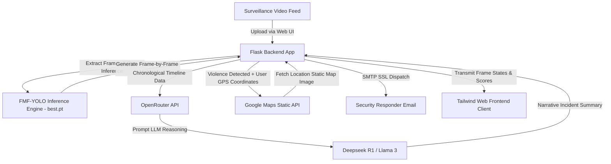

# ActiGuard-LLM: Smart Surveillance & Violence Detection System

ActiGuard-LLM is an AI-powered real-time security surveillance system. It integrates computer vision (**FMF-YOLO**), Large Language Models (**LLMs via OpenRouter**), to detect violence, generate security incident reports, and dispatch geolocated alerts immediately.

---

## 📽️ Test Result Videos & Outputs
Reviewers can quickly verify the performance and accuracy of ActiGuard-LLM by viewing the input and output test results below.
> 💡 Click any **▶ Watch Output Video** link to open GitHub's built-in video player.

---

### 🎬 Test 1 
> Sudden escalation; physical struggle detected; high confidence scores.

| | |
|---|---|
| 📥 **Input Video** | [Input_Video_1.mp4](Test_Input%20videos/Input_Video_1.mp4) |
| 📤 **Output Video** | [▶ Watch Output Video](https://github.com/rasel1510/Actiguard-LLM/blob/main/Test_output_vidoes/test_1.webm) |

---

### 🎬 Test 2 
> Normal crowd activity; steady green indicator showing normal behavior.

| | |
|---|---|
| 📥 **Input Video** | [Input_Video_2.mp4](Test_Input%20videos/Input_Video_2.mp4) |
| 📤 **Output Video** | [▶ Watch Output Video](https://github.com/rasel1510/Actiguard-LLM/blob/main/Test_output_vidoes/test_2.webm) |

---

### 🎬 Test 3 
> General public environment; no physical conflict; high normal confidence.

| | |
|---|---|
| 📥 **Input Video** | [Input_Video_4.mp4](Test_Input%20videos/Input_Video_4.mp4) |
| 📤 **Output Video** | [▶ Watch Output Video](https://github.com/rasel1510/Actiguard-LLM/blob/main/Test_output_vidoes/test_4.webm) |

---

### 🎬 Test 4 
> Physical altercations detected; triggers real-time red blinking indicator.

| | |
|---|---|
| 📥 **Input Video** | [Input_video_5.mp4](Test_Input%20videos/Input_video_5.mp4) |
| 📤 **Output Video** | [▶ Watch Output Video](https://github.com/rasel1510/Actiguard-LLM/blob/main/Test_output_vidoes/test_5.webm) |


## 🏗️ System Design & Architecture
ActiGuard-LLM is built on a modular pipeline ensuring low-latency inference, rich UI interaction, and secure alert propagation:



### Key Workflow Steps
1. **Video Processing**: The user uploads a video file. The Flask backend processes it using custom FMF-YOLO weights (`best.pt`) optimized for violence classification. Bounding boxes and confidence thresholds are extracted at dynamic frame rates to ensure rapid processing.
2. **LLM Summary Generation**: Frame results are formatted into a chronological timeline sequence. This state data is sent to OpenRouter API (Deepseek R1 / Llama 3) to draft a narrative incident report summarizing escalation points, transitions, and durations.
3. **Alert & Geolocation Dispatch**: If violence is detected, the frontend client captures the browser's current GPS location. The backend takes the coordinates, queries the Google Maps Static API for an image map, and dispatches an email notification containing the map, coordinates, and details to safety personnel.
4. **Interactive Dashboard Sync**: The frontend features a custom HTML5 video player synchronized frame-by-frame with the FMF-YOLO confidence scores. Interactive indicators (Red for Violence, Green for Non-Violence) dynamically blink and reflect active scores.

---

## 📁 Project Folder Structure

```text
ActiGuard-LLM/
├─ app.py
├─ requirements.txt
├─ Procfile
├─ .gitignore
├─ .env (ignored)
├─ README.md
├─ templates/
│   ├─ index.html
│   └─ Navbar.html
├─ static/
│   ├─ index.html
│   └─ Navbar.html
├─ models/
│   └─ best.pt
├─ utils/
│   └─ (script files like FMF-YOLO.py, LLM_evaluation.py, etc.)
└─ Test_Input videos/
    ├─ Input_Video_1.mp4
    └─ ...
```

## 🛠️ Tools & Technologies Used
* **Web Framework**: Python Flask (Robust, lightweight server-side routing)
* **Computer Vision**: FMF-YOLO (High-speed spatial feature and action recognition)
* **Language Models**: Deepseek R1 & Meta Llama 3 (via OpenRouter API)
* **Map & Coordinates API**: Google Maps Static API (Geographic image mapping)
* **Front-End Styling**: TailwindCSS (Modern, clean, responsive UI layouts)
* **Notification Protocol**: SMTP / SSL (Secure mail transmission)
* **Environment Security**: Python-dotenv (Secures API keys and credentials locally)

---

## 🚀 Setup & Installation

### 1. Clone the Repository
```bash
git clone https://github.com/rasel1510/Actiguard-LLM.git
cd Actiguard-LLM
```

### 2. Install Dependencies
Make sure you have Python 3.8+ installed. Run:
```bash
pip install flask ultralytics python-dotenv requests opencv-python
```

### 3. Setup Environment Variables
Create a file named `.env` in the root directory:
```env
# Email Alert Config

EMAIL_PASSWORD="your-app-password" # App password from email provider

# Google Maps Static API Key
GOOGLE_MAPS_API_KEY="your-google-maps-api-key"

# OpenRouter API Key
OPENROUTER_API_KEY="your-openrouter-api-key"
```
*(Note: `.env` is already configured in `.gitignore` so your credentials will never be pushed to GitHub.)*

---

## 💻 How to Use the Application

### 1. Run the Flask Server
Start the local server using:
```bash
python app.py
```
By default, the server runs on `http://127.0.0.1:5000/`.

### 2. Access the Application
* Open `http://127.0.0.1:5000/` in your browser.
* Allow the browser to access your location (this ensures the system can generate a map if violence is detected).

### 3. Upload and Analyze Video
* Click **Choose File** and select a surveillance video (such as one of the samples in `Test_Input videos/`).
* Click **Upload & Detect**.
* A glassmorphic loader will display while the YOLO model processes the frames and the LLM writes the narrative summary.

### 4. Interactive Review
* Play the video. You will see the **Violence** (Red) and **Non-Violence** (Green) indicator lights toggle in real-time.
* Hovering, scrubbing, or pausing the video dynamically locks the lights and displays the confidence score for that specific frame.
* Read the narrative incident report on the right-hand panel.

### 5. Our K1 dataset Link: https://www.kaggle.com/datasets/raselahmed2091/violence-data ., https://ieeexplore.ieee.org/abstract/document/9014714
### 6. Our K2 dataset Link: https://www.kaggle.com/datasets/raselahmed2091/violence2nddata